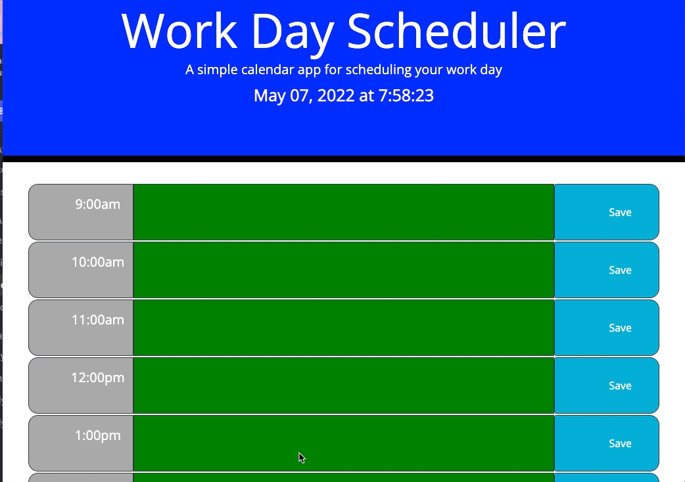

# Work Day Scheduler

##  I was tasked with this project to create a simple work day scheduler.  This will allow user to save events to each hour of the day.

###  Thinks that i included in this Work Day Scheduler

1. When user opens page the current date and time is displayed.

2. The user is present time blocks for each hour of a standard business day.

3. Each time block will show whether the hour is in the past, present, or future for that day.

4. The user will be able to click into the time block and enter an event.

5. When the user clicks save the event will be saved to local storage. If the user refreshes the page the event will stay on the page.

[gitHub pages](https://cefaust.github.io/Work-Day-Scheduler/)
